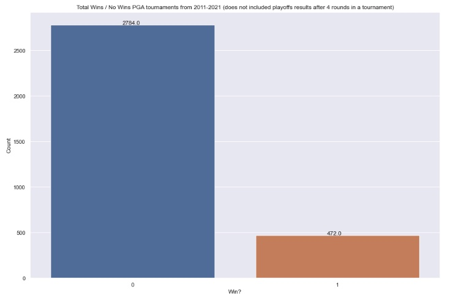
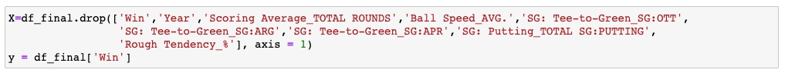
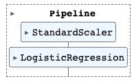
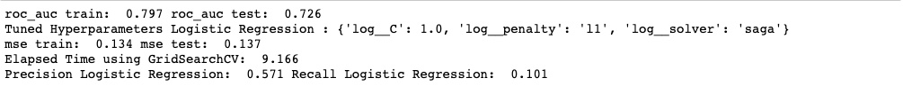
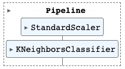
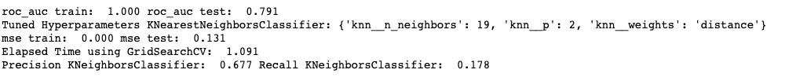
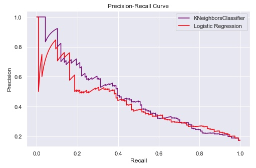
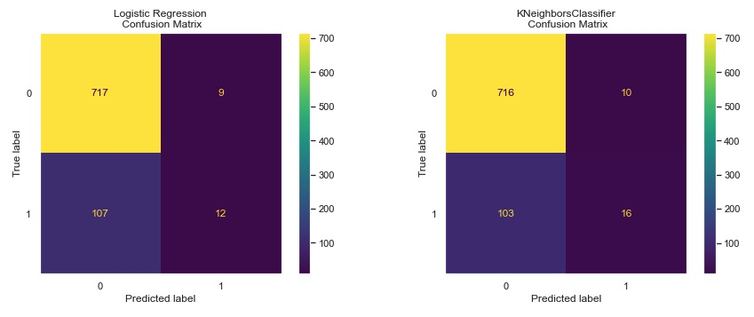
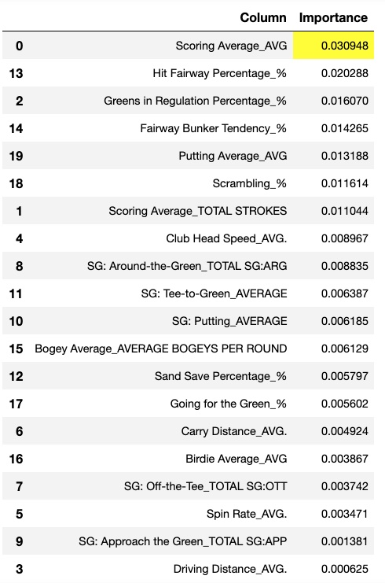

<h1> PREDICTING PGA TOUR PLAYER'S CHANCE TO WIN A PGA TOUR-TOURNAMENT</h1>

This python application using jupyter notebook predicts the chance of any pga tour player to win a tournament using Logistic Regression as a Supervized Machine Learning Algorithm.

 
 
 

  
The current CRISP-DM Process Model for Data Mining (see Figure 1) was followed.

 
 

<h4 align="center"> Figure 1</h4>

<h2>Business Understanding</h2>

The Business goal is  to come up with a supervized machine learning classification model, in this particular case, logistic regression was chosen. The output is binary, meaning that a player must get 1 to have high chance to win, or 0 to have  zero chance to win.The dataset was obtained by doing web scraping in the offical website of the PGA Tour (https://www.pgatour.com/stats), which contained the statistics collected from the tournaments played since 1980. In this particular application, the statistics used were from 2011-2021, i.e., covering only 10 years span. However, the potential user can easily covered the completed span (1980-2022) is desired by using the jupyter notebook attached.

<h2>Data Understanding</h2>

As mentioned before, the dataset was scraped from the offical website of the PGA Tour, covering only ten years span of turnaments (2011-2021) in this particular case. it consists of 27 columns and 4122 rows as shown on Figure 2. The target/dependent columns is "Win" which is binary (0=did not win and 1 = won). This variable is imbalanced as will be seen later, and basically indicate winning a PGA tournament.

 
 

<h4 align="center"> Figure 2</h4>

 
 

<h4 align="center"> Figure 3</h4>

<h2>Data Preparation</h2>

All the independent variables are numerical. Before cleaning the dataset, the index was reset, and the column: 'PLAYER NAME' was dropped (see Figure 4), since  the name of the pga players won't be needed, only their statistics for further analysis. The null values were identified asshown on Figures 5, and dropped. The dataset was reduced to 27 columns and  3380 rows as shown on Figure 6. Duplicates was observed in just one row as shown on Figure 7.

  
 
 

<h4 align="center"> Figure 4</h4>

 

<h4 align="center"> Figure 5</h4>

 

<h4 align="center"> Figure 6</h4>

 

<h4 align="center"> Figure 7</h4>

A correlation matrix was generated in order to explore how the variables correlated each other, i.e., potentially helping to reduced the number of independent variables that will be finally used. The results are shown on Figure 8, indicating that there a number of independent variables are highly positive correlated between each other. As results, the following columns were dropped: 'Ball Speed_AVG.','SG: Tee-to-Green_SG:OTT','SG: Tee-to-Green_SG:ARG','SG: Tee-to-Green_SG:APR','SG: Putting_TOTAL SG:PUTTING','Rough Tendency_%'. Also the column: 'Scoring Average_TOTAL ROUNDS' was dropped, since it won't be needed for the upcoming analysis.

 

<h4 align="center"> Figure 8</h4>

More insight into the dataset can be gained before finalizing the data preparation by showing the values distribution for all the independent variables as shown on Figure 9. As it can be observed, all of them show a quite nice normal distribution. Also, it is evident that there are no outliers present.

 

<h4 align="center"> Figure 9</h4>

The target column, i.e., the dependent variables: "Win" is binary (0=did not win and 1= won), and imbalanced as shown on Figure 10:

 
 

<h4 align="center"> Figure 10</h4>

A good understanding on the differences in statistics among the players who won and the ones who did not throughout the years (2011-2021) can be obtained using boxplots: independent variables vs. years, using the dependent variable: 'Win'  for colour encoding as seen on Figure 11. It can be seen that the players who won performed much better in all the categories/statistics, in particular the follow ones:  'Scoring Average_AVG', 'Driving Distance_AVG', '  Club Head Speed_AVG.', 'SG: Off-the-Tee_TOTAL SG:OTT', ' SG: Approach the Green_TOTAL SG:APP', and 'SG: Tee-to-Green_AVERAGE'. Also note that the difference in 'SG: Putting_AVERAGE' is not significant  between players regardless if they won or did not, indicating that putting is not the most important factor to win or lose a tournament in the PGA tour as it will also be seen when the permutation_importance function is applied. Another important observation is that the only two category/statistics that have greatly improved through the years are: 'Driving Distance_AVG', and '  Club Head Speed_AVG.', consequently impacting 'Scoring Average_AVG'. The major reasons behind it are : golf players are more athletic than ever, and equipment technology has dramatically improved through the years, specially the last years.

 

<h4 align="center"> Figure 11</h4>

<h3>Splitting the variables</h3>

Splitting the dependent variable from the independent variables and assigning them to y and X respectively was done as shown on Figure 12:

 

<h4 align="center"> Figure 12</h4>

<h3>Cross-Validation Approach</h3>

Although, the dependent variable is imbalanced, the HoldOut Cross-validation was used. In this technique, the whole dataset is randomly partitioned into a training set and validation set using the train_test_split function. The stratify parameter was used  to preserve  the dataset proportions for better prediction and reproduceability of results as shown on Figure 13:

 
 

<h4 align="center"> Figure 13</h4>

<h2>Modelling</h2>

It is well known that working with imbalance data is always a challenge for any particular Machine Learning Classification Model. In this particular piece of work, Logistic Regression model was chosen as the Supervise Machine Learning Model due to the binary nature of the dependent/target variable (has only 2 outputs), and its capacity to predict the likelihood of events by looking at historical data points. However, as any machine learning algorithm, Logistic Rgression works much better when its hyperparamters are optimized using the appropriate metric. In this particular project, the metric chosen was: 'roc_auc' (the area under the ROC curve), since it works quite well for imbalance data. The metric called 'Recall' was tested as scoring to optimize the hyperparamters, but results were not encouraged. The pipeline model used is shown on Figure 14. 

 

<h4 align="center"> Figure 14</h4>

The GridSearchCV function was used to optimized several hyper-parameters tested (see Figure 15). The optimum values for those, and the metrics results are shown on Figure 16. 

 

<h4 align="center"> Figure 15</h4>

 

<h4 align="center"> Figure 16</h4>

As it can observed, the metrics: 'roc_auc', 'precision', and 'recall' were not that good, in particular the last one, meaning that the proportion of False  Negatives (FN): the model incorrectly predicts a player most likely will lose  a tournament to True Positives (TP):the model correctly predicts a player will likely win a tournament is too high, making the recall score way too low as it will be seen visually in the confusion matrix later. As a result, it was decided to test a different Machiner Learning classification model, in this case: the KNeighborsClassifier.The pipeline model used is shown on Figure 17. 

 

<h4 align="center"> Figure 17</h4>

The GridSearchCV function was used to optimized several hyper-parameters tested (see Figure 18). The optimum values for those, and the metrics results are shown on Figure 19. 

 

<h4 align="center"> Figure 18</h4>

It well noticed that the metrics have slightly improved using KNeighborsClassifier as shown on Figure 19.

 

<h4 align="center"> Figure 19</h4>

<h2>Evaluation</h2>
As it can be observed,  the best model seems to be KNeighborsClassifier by slight margin over the Logistic Regression. The precision- recall curve was decided to use, since this type of curve works much better for moderate to large imbalanced data than the ROC-curve. This curve (see figure 20) also indicates that the best model is the  KNeighborsClassifier (red line). It also did consume less elapsed time than that of Logistic Regression. The confusion matrix  as also built as shown on Figure 21. It is thought that  decreasing the False  Negatives (FN): the model incorrectly predicts a player most likely will lose  a tournament (100 and 97 in each model),and increasing True Positives (TP):the model correctly predicts a player will likely win a tournament (18 and 21 in each model), i.e. improving the recall score is of paramount importance, since it will help to more correctly assign odd to players for betting purpose for instance. Unfortunately, both models performed fairly poor in the Recal score (.153 and .178 for Logistic regression and KNeighborsClassifier respectively).

 
 

<h4 align="center"> Figure 20</h4>

 
 

<h4 align="center"> Figure 21</h4>

Ranking the the importance of the independent variables that matter in predicting 'Win' can be done using the  tool permutation.importance (the results were filtered to only leave the columns with the importance greater than 0). The two  models built were used for the sake of comparison. In both models the independent variable: 'Scoring Average_AVG' ranked first, which makes sense (see Tables 1 and 2), since players win tournament by shooting the lowest scoring average. However, it is interesting that this variable is much more important in the Logistic Regression Model. Also note that in both models, the variables: 'Driving Distance_AVG', and  'Club Head Speed_AVG.' are not within the five most ones,i.e., indicating that swinging the club faster, and driving the ball longer do not uarantee  that a player will win a tournament. This is a pretty interesting observation that sometimes is overlooked by people who want to initiate their career in golf. Consistency, i.e, shooting low score, and course management (off the tee and around the green) seem to be the most important aspects to win PGA golf  tournaments.

 
 

<h4 align="center"> Table 1</h4>

 
 

<h4 align="center"> Table 2</h4>

