

<h1> PREDICTING PGA TOUR PLAYER'S CHANCE TO WIN A PGA TOUR-TOURNAMENT</h1>

This python application using jupyter notebook predicts the chance of any pga tour player to win a tournament using Logistic Regression as a Supervized Machine Learning Algorithm.

 
 
 

  
The current CRISP-DM Process Model for Data Mining (see Figure 1) was followed.

 
 

<h4 align="center"> Figure 1</h4>

<h2>Business Understanding</h2>

The Business goal is  to come up with a supervized machine learning classification model, in this particular case, logistic regression was chosen. The output is bynary, meaning that a player must get 1 to have high chance to win, or 0 to have  zero chance to win.The dataset was obtained by doing web scraping in the offical website of the PGA Tour (https://www.pgatour.com/stats), which contained the statistics collected from the tournaments played since 1980. In this particular application, the statistics used were from 2011-2021, i.e., covering only 10 years span. However, the potential user can easily covered the completed span (1980-2022) is desired by using the jupyter notebook attached.

<h2>Data Understanding</h2>
As mentioned before, the dataset was scraped from the offical website of the PGA Tour, covering only ten years span of turnaments (2011-2021) in this particular case. it consists of 27 columns and 4122 rows as shown on Figure 2. The target/independent columns is "Win" which is binary (0 and 1). This variable is imbalanced as will be seen later. 

 
 

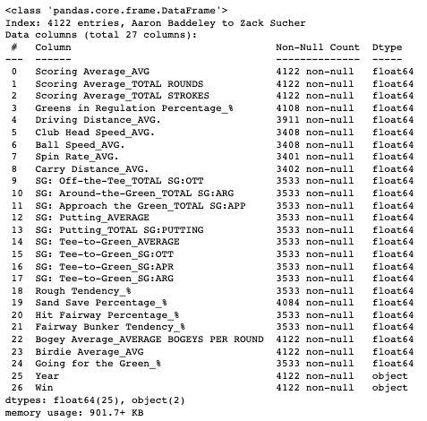
<h4 align="center"> Figure 2</h4>

 
 

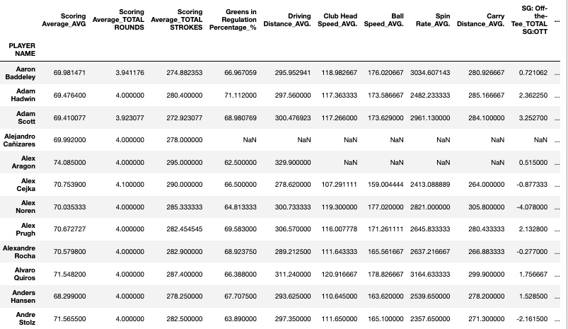
<h4 align="center"> Figure 3</h4>

<h2>Data Preparation</h2>
All the independent variables are numerical. Before cleaning the dataset, the index was reset, and the column: 'PLAYER NAME' was dropped (see Figure 4), since it won't be needed for further analysis. The null values were identified asshown on Figures 5, and dropped. The dataset was reduced to 27 columns and  3380 rows as shown on Figure 6. Duplicates was observed in just one row as shown on Figure 7.

 
 

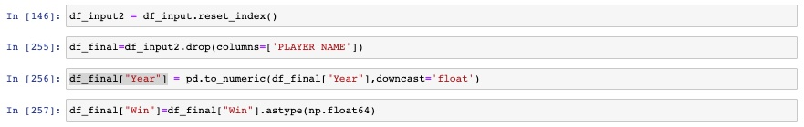
<h4 align="center"> Figure 4</h4>

 

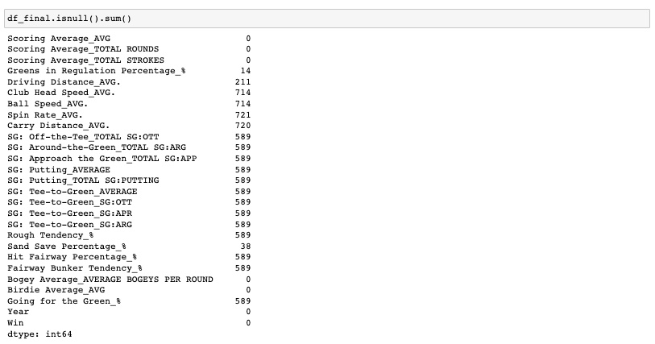
<h4 align="center"> Figure 5</h4>

 

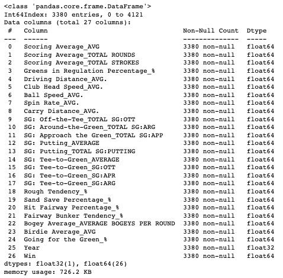
<h4 align="center"> Figure 6</h4>

 

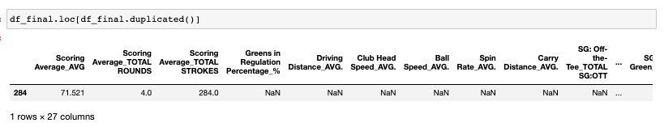
<h4 align="center"> Figure 7</h4>

A correlation matrix was generated in order to explore how the variables correlated each other, i.e., potentially helping to reduced the number of independent variables that will be finally used. The results are shown on Figure 8, indicating that there a number of independent variables are highly positive correlated between each other. As results, the following columns were dropped: 'Ball Speed_AVG.','SG: Tee-to-Green_SG:OTT','SG: Tee-to-Green_SG:ARG','SG: Tee-to-Green_SG:APR','SG: Putting_TOTAL SG:PUTTING','Rough Tendency_%'. Also the column: 'Scoring Average_TOTAL ROUNDS' was dropped, since it won't be needed for the upcoming analysis.

 

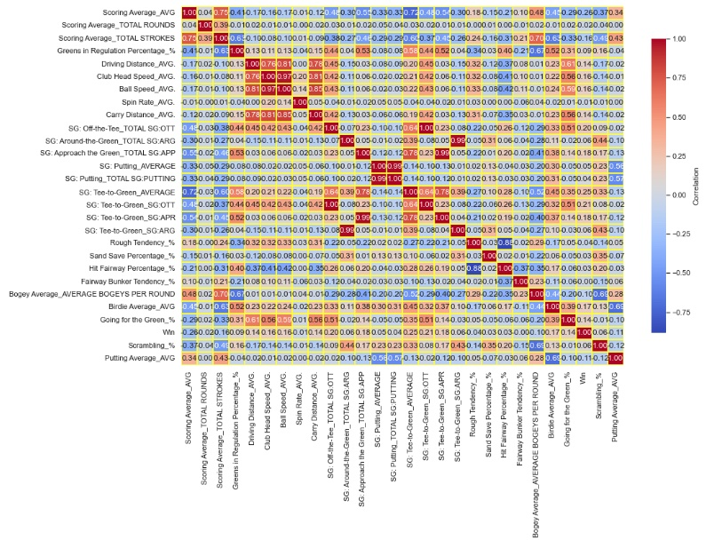
<h4 align="center"> Figure 8</h4>

More insight into the dataset can be gained before finalizing the data preparation by showing the value distribution for all the independent variables as shown on Figure 9. As it can be observed, all of them show a quite nice normal distribution. Also, it is evident that there are no outliers present.

 

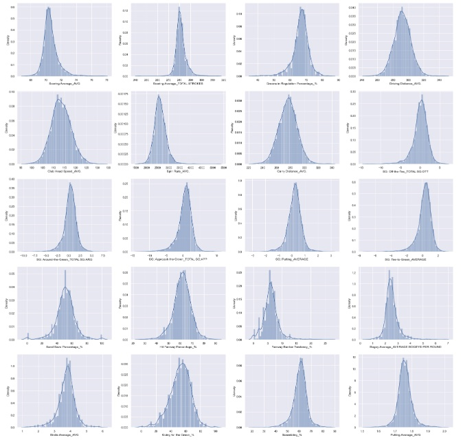
<h4 align="center"> Figure 9</h4>

A good understanding on the differences in statistics among the players who won and the ones who not,  can be obtained using boxplots: independent variables vs. years, using the dependent variable: 'Win' as a hue. It can seen that the players ranking 1st after the last round of each tournament yearly average perform much better in all the categories/statistics, in particular de follow ones:  'Scoring Average_AVG', 'Driving Distance_AVG', '  Club Head Speed_AVG.', 'SG: Off-the-Tee_TOTAL SG:OTT', ' SG: Approach the Green_TOTAL SG:APP', and 'SG: Tee-to-Green_AVERAGE'.
Please note that the difference in 'SG: Putting_AVERAGE' is not significant  between players regardless if they won or not. Another important observation is that the only two category/statistics that have improved through the years are: 'Driving Distance_AVG', and '  Club Head Speed_AVG.'.

 

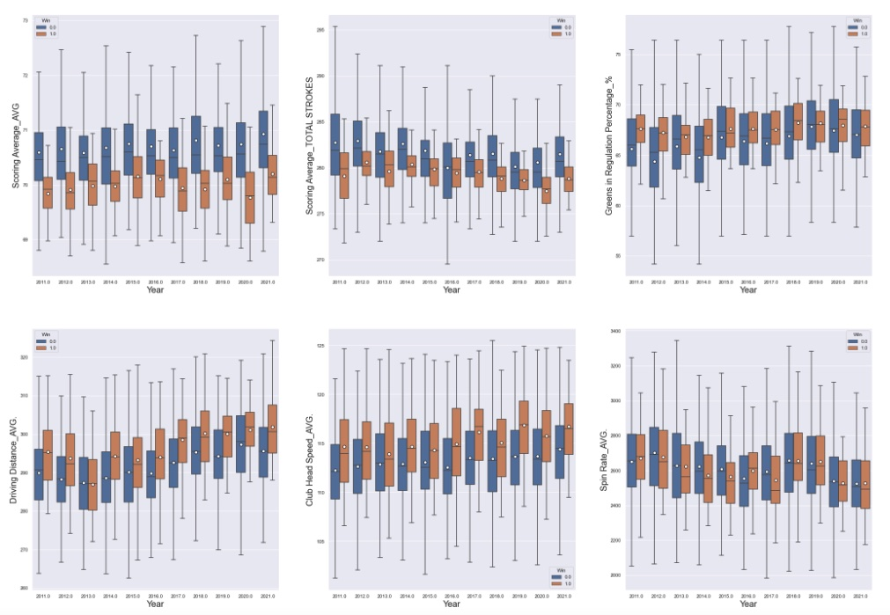
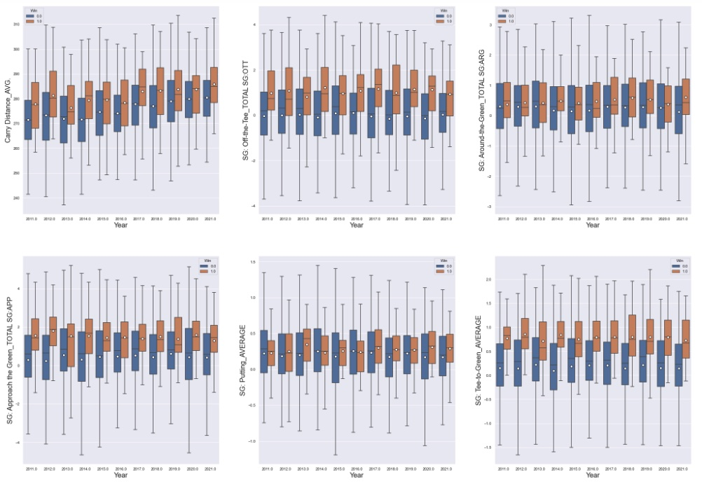
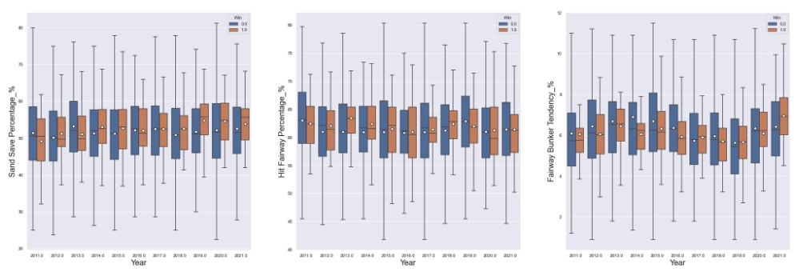
<h4 align="center"> Figure 10</h4>

