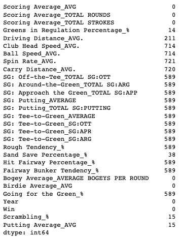
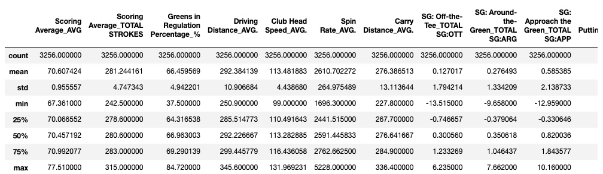
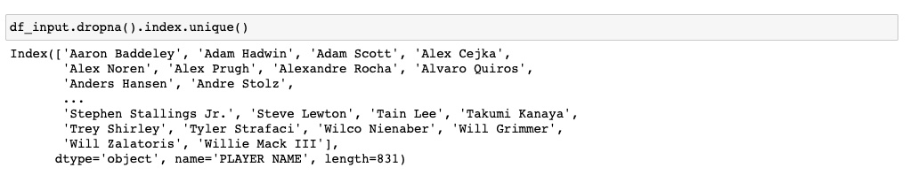
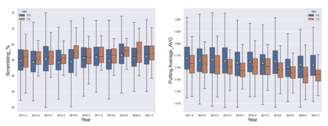
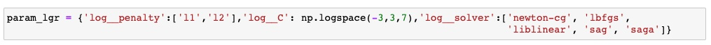
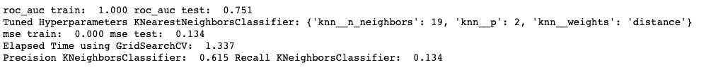
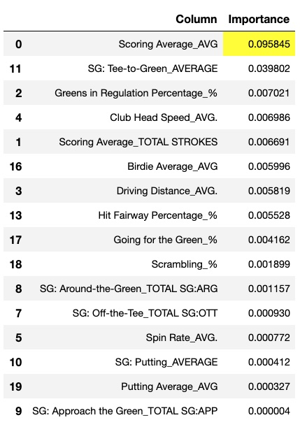

<h1> PREDICTING PGA TOUR PLAYER'S CHANCE TO WIN A PGA TOUR-TOURNAMENT</h1>

This python application using jupyter notebook predicts the chance of any pga tour player to win a tournament using Logistic Regression as a Supervized Machine Learning Algorithm.

 
 
 

  
The current CRISP-DM Process Model for Data Mining (see Figure 1) was followed.

 
 

<h4 align="center"> Figure 1</h4>

<h2>Business Understanding</h2>

The Business goal is  to come up with a supervized machine learning classification model, in this particular case, Logistic Regression was initially chosen, but  K-Nearest Neighbor was also tested for reasons that will be explained later. The output is  binary, meaning that a player must get 1 to have high chance to win, or 0 to have very small/zero chance to win a PGA tournament.The dataset was obtained by doing web scraping in the offical website of the PGA Tour (https://www.pgatour.com/stats), which contained the statistics collected from the tournaments played since 1980. In this particular application, the statistics used were from 2011-2021, i.e., covering only 10 years span. However, the potential user can easily covered the completed span (1980-2022) is desired by using the jupyter notebook attached.

[Jupiter Notebook used](https://github.com/Leopard-2019/PREDICTING-PGA-TOUR-PLAYER-S-CHANCE-TO-WIN-A-PGA-TOUR-TOURNAMENT/blob/main/notebook/Capstone_Project_Data-Copy1.ipynb)

<h2>Data Understanding</h2>

As mentioned before, the dataset was scraped from the offical website of the PGA Tour, covering only ten years span of turnaments (2011-2021) in this particular case. it originally consists of 27 columns and 4122 rows as shown on Figure 2. it is important to mention that the statistics were averaged yearly for each player. The target/dependent columns is "Win" which is binary (0=did not win and 1 = won). This variable is imbalanced as will be seen later, and basically indicates winning or not winning a PGA tournament during the aforementioned time span.

 
 

<h4 align="center"> Figure 2</h4>

 
 

<h4 align="center"> Figure 3</h4>

<h2>Data Preparation</h2>

All the independent variables are numerical. Before cleaning the dataset, the index was reset, and the column: 'PLAYER NAME' was dropped (see Figure 4), since  the name of the pga players won't be needed, only their statistics for further analysis. The null values were identified as shown on Figures 5, and dropped. The dataset was reduced to 27 columns and  3380 rows as shown on Figure 6. Duplicates was observed in just one row as shown on Figure 7.

  
 
 

<h4 align="center"> Figure 4</h4>

 

<h4 align="center"> Figure 5</h4>

 

<h4 align="center"> Figure 6</h4>

 

<h4 align="center"> Figure 7</h4>

A correlation matrix was generated in order to explore how the variables correlated among each other, i.e., potentially helping to reduced the number of independent variables that will be finally used. The results are shown on Figure 8, indicating that there are a number of independent variables that highly positive correlated between each other. As a results, the following columns were dropped: 'Ball Speed_AVG.','SG: Tee-to-Green_SG:OTT','SG: Tee-to-Green_SG:ARG','SG: Tee-to-Green_SG:APR','SG: Putting_TOTAL SG:PUTTING','Rough Tendency_%'. Also the column: 'Scoring Average_TOTAL ROUNDS' was dropped, since it won't be needed for the upcoming analysis.

 

<h4 align="center"> Figure 8</h4>

More insight into the dataset can be gained before finalizing the data preparation by showing the values distribution for all independent variables as shown on Figure 9. As it can be observed, all of them show a quite nice normal distribution. Also, it is evident that there are no outliers present. Also, the statistical summary of those independent variables is shown on Figure 10.

 

<h4 align="center"> Figure 9</h4>

 

<h4 align="center"> Figure 10</h4>

The target column, i.e., the dependent variables: "Win" is binary (0=did not win and 1= won), and is clearly imbalaced. it is important to point out that in this analysis 'Win' means a player/players ranked 1st after 4 rounds in a PGA tournament (see Figure 11). Therefore, the playoffs results when players ended up in a tie after final round are not included. In total, there were 831 unique players whom competed from 2011-2021 as shown on Figure 12, i.e, there were many of them who did compete multiple times during the aforementioned time span.

 
 

<h4 align="center"> Figure 11</h4>

 
 

<h4 align="center"> Figure 12</h4>

A good understanding on the differences in statistics among the players who won and the ones who did not throughout the years (2011-2021) can be obtained using boxplots: independent variables vs. years, using the dependent variable: 'Win'  for colour encoding as seen on Figure 13. It can be seen that the players who won performed much better in all the categories/statistics, in particular the follow ones:  'Scoring Average_AVG', 'Driving Distance_AVG', '  Club Head Speed_AVG.', 'SG: Off-the-Tee_TOTAL SG:OTT', ' SG: Approach the Green_TOTAL SG:APP', and 'SG: Tee-to-Green_AVERAGE'. Also note that the difference in 'SG: Putting_AVERAGE' is not significant  between players regardless if they won or did not, indicating that putting is not the most important factor to win or lose a tournament in the PGA tour. This observation will be confirmed when the permutation_importance function is applied later in the analysis. Another important observation is that the only two category/statistics have greatly improved through the years: 'Driving Distance_AVG', and '  Club Head Speed_AVG.'. The major reasons behind it are : golf players are more athletic than ever, and equipment technology has dramatically improved through the years, specially the last 10 years.

 

<h4 align="center"> Figure 13</h4>

<h3>Splitting the variables</h3>

Splitting the dependent variable from the independent variables and assigning them to y and X respectively was done as shown on Figure 14:

 

<h4 align="center"> Figure 14</h4>

<h3>Cross-Validation Approach</h3>

Although, the dependent variable is imbalanced, the HoldOut Cross-validation was used. In this technique, the whole dataset is randomly partitioned into a training set and validation set using the train_test_split function. The stratify parameter was used  to preserve  the dataset proportions for better prediction and reproduceability of results as shown on Figure 15:

 
 

<h4 align="center"> Figure 15</h4>

<h2>Modelling</h2>

It is well known that working with imbalance data is always a challenge for any particular Machine Learning Classification Model. In this particular piece of work, Logistic Regression model was initially chosen as the Supervise Machine Learning Model due to the binary nature of the dependent/target variable (has only 2 outputs), and its capacity to predict the likelihood of events by looking at historical data points. However, as any machine learning algorithm, Logistic Rgression works much better when its hyperparamters are optimized using the appropriate metric. In this particular project, the metric chosen was: 'roc_auc' (the area under the ROC curve), since it works quite well for imbalance data. The metric called 'Recall' was tested as scoring to optimize the hyperparamters, but results were not encouraged. The pipeline model used is shown on Figure 16. 

 

<h4 align="center"> Figure 16</h4>

The GridSearchCV function was used to optimized several hyper-parameters tested (see Figure 17). The optimum values for those, and the metrics results are shown on Figure 18. 

 

<h4 align="center"> Figure 17</h4>

 

<h4 align="center"> Figure 18</h4>

As it can observed, the metrics: 'precision', and 'recall' were not that good, in particular the last one, meaning that the proportion of False  Negatives (FN): the model incorrectly predicts a player most likely will lose  a tournament to True Positives (TP):the model correctly predicts a player will likely win a tournament is too high, making the recall score way too low as it will be seen visually in the confusion matrix later. As a result, it was decided to test a different Machiner Learning classification model, in this case: the  K-Nearest Neighbor.The pipeline model used is shown on Figure 19. 

 

<h4 align="center"> Figure 19</h4>

The GridSearchCV function was used to optimized several hyper-parameters tested (see Figure 20). The optimum values for those, and the metrics results are shown on Figure 21. It well noticed that the metrics have slightly improved using  K-Nearest Neighbor model.

 

<h4 align="center"> Figure 20</h4>

 

<h4 align="center"> Figure 21</h4>

<h2>Evaluation</h2>

As it can be observed,  the best model seems to be  K-Nearest Neighbor by slight margin over the Logistic Regression. The precision- recall curve was decided to use, since this type of curve works much better for moderate to large imbalanced data than the ROC-curve. This curve (see figure 22) also indicates that the best model is the   K-Nearest Neighbor (purple line). It also did consume less elapsed time than that of Logistic Regression. The confusion matrix  as also built as shown on Figure 23. It is thought that  decreasing the False  Negatives (FN): the model incorrectly predicts a player most likely will lose  a tournament (100 and 97 in each model),and increasing True Positives (TP):the model correctly predicts a player will likely win a tournament (18 and 21 in each model), i.e. improving recall score is of paramount importance, since it will help to more correctly assign odd to players for betting purpose for instance, o more plainly said, predict in a more confident and robust way who will win a PGA tournament. Unfortunately, both models performed fairly poor in the Recal score (.153 and .178 for Logistic regression and  K-Nearest Neighbor respectively).

 
 

<h4 align="center"> Figure 22</h4>

 
 

<h4 align="center"> Figure 23</h4>

Ranking the the importance of the independent variables that matter in predicting the target variable 'Win' can be done using the  tool permutation.importance (the results were filtered to only leave the columns with the importance greater than 0). The two  models built were used for the sake of comparison. In both models the independent variable: 'Scoring Average_AVG' ranked first, which makes sense (see Tables 1 and 2), since players win tournament by shooting the lowest scoring average. However, it is interesting that this variable is much more important in the Logistic Regression Model. Also note that in both models, the variables: 'Driving Distance_AVG', and  'Club Head Speed_AVG.' are not within the five most important ones,i.e., indicating that swinging the club faster, and driving the ball longer do not guarantee  that a player will win a tournament. This is a pretty interesting observation that sometimes is overlooked by people who want to initiate their career in golf. Consistency, i.e, shooting low score, and course management (off the tee and around the green) seem to be the most important aspects to win PGA golf tournaments.

 
 

<h4 align="center"> Table 1</h4>

 
 

<h4 align="center"> Table 2</h4>

<h2>Deployment</h2>
The code was written in Python, and it is available in a Jupyter Notebook that can be accessed in the link posted at the beginning of this document.

<h2>Main Conclusions & Recomendations</h2>

1. The final dataset, after cleaning (there was not need to remove outliers), dropping unnecessary columns consists of 20 columns and 3256 rows. The target columns was "Win" which stands:  Win in a PGA tournament during the period 2011-2021

2. it is thougth that the best classification model is the Logistic Regression, because it is telling the history more clear on which statistics are more imporant to win a PGA tournament, despite the fact that its metrics: precision and recal are a bit lower thant that of the  K-Nearest Neighbor. However, both models performed poorly in the recall score (less that 0.20).

 3. The metric used to estimate the optimum parameters for each model was 'roc_auc', since it works quite well for imbalance data 

 4. The precision- recall curve was chosen also as a indicator, since works much better for moderate to large imbalanced data than the ROC-curve, which is the case for the dataset used in this analysis.

 5. The most important independent variable was: 'Scoring Average_AVG'  in both models tested. However, it is interesting that this variable is much more important in the Logistic Regression Model

 6. The independent variables: 'Driving Distance_AVG', and  'Club Head Speed_AVG.' are not within the five most important ones,i.e., indicating that swinging the club faster, and driving the ball longer do not guarantee  that a player will win a tournament. This is a pretty interesting observation that sometimes is overlooked by people who want to initiate their career in golf.

 7. Consistency, i.e, shooting low score, and course management (off the tee and around the green) seem to be the most important aspects to win PGA golf tournaments as are obviously expected.

 8.The next steps will consist testing ensembles techniques such as bagging and boostingin in order to explore the possibility to increase both Precision and Recall scores, i.e., proving a more robust, powerful, and confident Supervized Machine Learning Classification Model.
